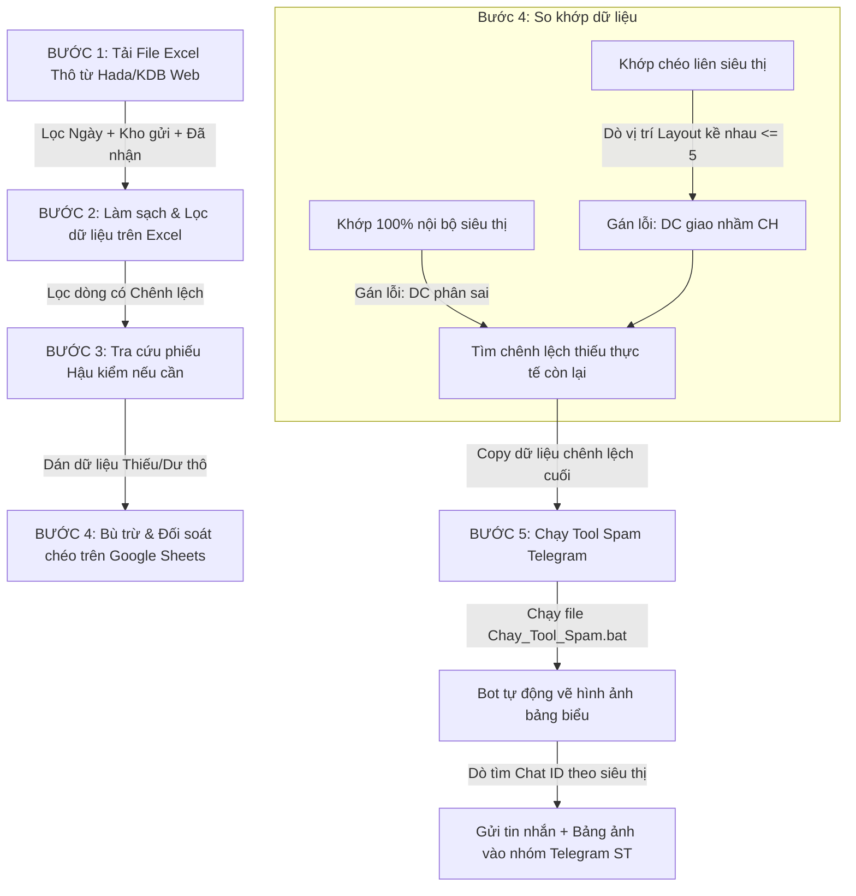

# HƯỚNG DẪN QUY TRÌNH ĐỐI SOÁT HÀNG NGÀY & GỬI CẢNH BÁO TELEGRAM
*Tài liệu dành cho thành viên mới (New Member Onboarding)*

Tài liệu này mô tả chi tiết quy trình 5 bước đối soát dữ liệu thừa/thiếu (Dư - Thiếu) của các ngành hàng và cách vận hành hệ thống gửi tin nhắn cảnh báo tự động đến các nhóm Telegram của siêu thị.

---

## I. SƠ ĐỒ QUY TRÌNH TỔNG QUAN (WORKFLOW)

Dưới đây là sơ đồ luồng đi của dữ liệu từ khi lấy trên hệ thống web cho đến khi gửi tin nhắn Telegram:

---

## II. HƯỚNG DẪN CHI TIẾT TỪNG BƯỚC THỰC HIỆN

### BƯỚC 1: Tải Dữ Liệu Thô từ Hệ Thống
*   **Địa chỉ Web:** Truy cập cổng thông tin quản lý nội bộ Hada/KDB (`next.kingfood.co/operator/transfer`).
*   **Thao tác lọc:**
    1.  Chọn **Kho gửi** tương ứng với ngành hàng cần đối soát (Ví dụ: `F2024 - Miền Đông - SCF - Quá Cảnh` cho hàng Đông Mát).
    2.  Chọn **Trạng thái phiếu**: Lọc các phiếu đã `Đã nhận`.
    3.  Chọn **Thời gian**: Chọn ngày cần đối soát (ví dụ: ngày hôm trước).
    4.  Nhấn **Tìm kiếm** $\rightarrow$ bấm **Xuất file** để tải file Excel về máy (lưu mặc định tại thư mục `Downloads`).

### BƯỚC 2: Lọc Dữ Liệu Chênh Lệch trên Excel
*   **Mục đích:** Chỉ giữ lại các dòng hàng thực sự bị thừa hoặc thiếu để xử lý, loại bỏ các dòng hàng khớp.
*   **Thao tác:**
    1.  Mở file Excel thô vừa tải về.
    2.  Kéo đến cột **Số lượng nhận (Hệ thống)** và cột **Số lượng thực tế**.
    3.  Sử dụng công cụ **Filter** của Excel để lọc ra các dòng có chênh lệch giữa lượng xuất và lượng nhận.
    4.  Lưu riêng danh sách chênh lệch này (Ví dụ đặt tên: `THIẾU 12.08 - THỊT CÁ.xlsx`).

### BƯỚC 3: Kiểm Tra Trạng Thái Hậu Kiểm
*   **Mục đích:** Xác minh các phiếu có ghi chú hoặc đang được xử lý hậu kiểm để tránh báo cáo sai lệch.
*   **Thao tác:**
    1.  Copy mã phiếu chuyển (dạng `PT...`) từ Excel bị lệch.
    2.  Vào mục **Hậu kiểm** trên trang Web KDB, dán mã phiếu để kiểm tra trạng thái thực nhận được duyệt cuối cùng.

### BƯỚC 4: So Khớp & Bù Trừ chéo trên Google Sheets Trung Tâm
*   **Địa chỉ:** Mở file Google Sheets đối soát dùng chung của bộ phận.
*   **Thao tác:**
    1.  Dán (paste) dữ liệu Thiếu/Dư đã lọc ở Bước 2 vào các cột nhập liệu thô.
    2.  **Hệ thống Sheets tự động chạy công thức đối soát:**
        *   *Lỗi dán nhầm mã thùng:* Nếu trong cùng siêu thị có 1 sản phẩm thừa đúng bằng lượng thiếu $\rightarrow$ Hệ thống tự động cấn trừ và gán lỗi **`DC phân sai`**.
        *   *Lỗi giao nhầm siêu thị kề nhau:* Hệ thống dựa vào file Layout (ví dụ: `Layout MD.xlsx`) để dò vị trí xếp hàng của các siêu thị. Nếu siêu thị đứng cạnh nhau có lượng thừa - thiếu khớp nhau $\rightarrow$ Cấn trừ và gán lỗi **`DC giao nhầm CH`**.
    3.  **Lọc kết quả cuối cùng:** Lọc lấy các dòng **Thiếu thực tế còn lại** (những dòng không thể cấn trừ) để chuẩn bị gửi cảnh báo cho siêu thị.

### BƯỚC 5: Kích Hoạt Tool Gửi Cảnh Báo Telegram
*   **Thao tác:**
    1.  Mở thư mục ngành hàng tương ứng trên máy tính (Ví dụ thư mục: `ĐÔNG MÁT`).
    2.  Click đúp chuột để chạy file **`Chay_Tool_Spam.bat`**.
    3.  Màn hình Console đen sẽ hiện lên. Script Python sẽ tự động đọc dữ liệu thiếu thực tế trên Google Sheets, vẽ thành bảng ảnh báo cáo chênh lệch, tra cứu Chat ID nhóm Telegram của siêu thị tương ứng và gửi tin nhắn cảnh báo trực tiếp vào nhóm.
