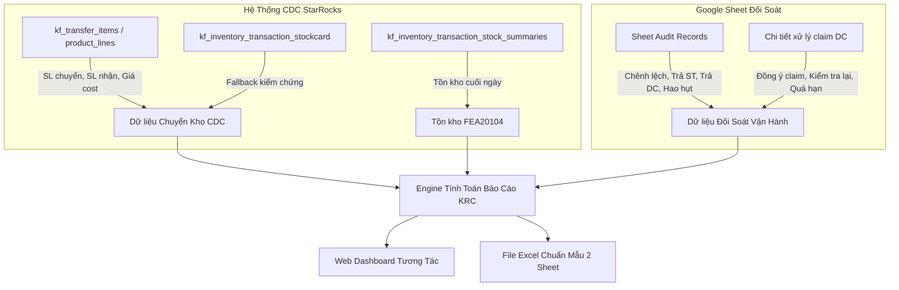

# TÀI LIỆU ĐẶC TẢ CHI TIẾT LOGIC BÁO CÁO TỔNG HỢP HÀNG NGÀY
## KHO RAU CỦ & BÁNH TƯƠI (KRC & BÌNH THẮNG)

---

### I. TỔNG QUAN HỆ THỐNG & NGUỒN DỮ LIỆU

Báo cáo **Tổng Hợp Hàng Ngày - Kho Rau Củ & Bánh Tươi** là hệ thống đối soát dữ liệu đa nguồn giữa:
1. **CDC StarRocks (Kingfood SCM WMS/ERP)**: Dữ liệu vận hành chuyển kho thực tế từ DC đến toàn bộ hệ thống Siêu thị (ST).
2. **Google Sheet Đối Soát (Vận Hành & QA)**: Dữ liệu chênh lệch, phân loại lỗi, xử lý claim và phản hồi giữa ST & DC.
3. **Thẻ kho & Tồn kho StarRocks CDC**: Dữ liệu kiểm chứng sản lượng xuất thực tế và tồn kho kho Chờ Đối Soát (`FEA20104`).

---

### II. QUY TẮC PHÂN ĐỊNH KHO THEO MỐC NGÀY 22/09/2026

Do Kingfoodmart chuyển đổi trung tâm phân phối từ Kho cũ sang Kho Bình Thắng vào ngày **22/09/2026**, hệ thống áp dụng bộ lọc kho nguồn động theo ngày:

| Giai đoạn | Kho xuất DC chính (`from_branch_id`) | Kho nhận hàng dư / bù trừ | Kho Chờ Đối Soát / Tồn kho chênh lệch |
| :--- | :--- | :--- | :--- |
| **Trước 22/09/2026** (<= 21/09) | • `KRC` cũ: `5fdc170ebd89c10006f15b7c` • `KRCBT` cũ: `6a3e383fe20b440007640326` | `FEA20105` (KRCXLTT - Lệch Chuyển Hàng): `6982f5f1d360600007807f7b` | Tính theo lũy kế giá trị chênh lệch chuyển hàng (`cum_gt_cl`) |
| **Từ 22/09/2026 trở đi** (>= 22/09) | • `FEA20102` (Bình Thắng Quá Cảnh): `6aabb3f3f426e20007f81559` • `FEA20197` (Bình Thắng Bánh Tươi): `6aabb45fd18e9d00073200a4` | `FEA20204` (Bình Thắng Chờ Đối Soát): `6aabb403055d2e0007eb9ded` | Lấy trực tiếp tồn kho cuối ngày (`value_closing_stock`) kho **`FEA20104`**: `6a34ee90f230280007741634` |

> [!NOTE]
> **Loại trừ chuyển kho nội bộ**: Chỉ lấy phiếu chuyển có kho nhận là Siêu Thị (ST), tự động loại trừ chuyển nội bộ giữa các DC (`FEA20101`, `FEA20102`, `FEA20197`, `FEA20104`, `FEA20105`, `FEA20204`, `KRC`, `KRCBT`).

---

### III. CHI TIẾT 4 THẺ KPI ĐẦU TRANG

1. **Tổng SL chuyển (CDC)**:
   $$\text{Tổng SL chuyển} = \sum \text{SL chuyển hàng ngày (kg)}$$
2. **Tổng Giá trị chuyển (CDC)**:
   $$\text{Tổng GT chuyển} = \sum \text{GT chuyển hàng ngày (VNĐ)}$$
3. **% GT chênh lệch**:
   $$\% \text{ GT chênh lệch} = \frac{\sum \text{GT chênh lệch}}{\sum \text{GT chuyển (CDC)}} \times 100\%$$
   *(Kèm hiển thị tổng số tiền VNĐ chênh lệch phát sinh)*
4. **% Trả DC (Sau Net Dư)**:
   $$\% \text{ Trả DC (Sau Net)} = \max\left(0, \frac{\sum \text{GT trả DC} - \sum \text{GT dư}}{\sum \text{GT chuyển (CDC)}} \times 100\%\right)$$
5. **Số ST phục vụ**:
   $$\text{Max ST} = \max(\text{SL ST chuyển hàng ngày})$$ (quy mô mạng lưới Kingfoodmart, tối đa 231 ST).

---

### IV. ĐẶC TẢ CHI TIẾT 9 KHỐI DỮ LIỆU (52 DÒNG)

#### KHỐI 1: SỐ LƯỢNG (8 dòng)
| STT | Tên dòng | Nguồn dữ liệu | Công thức / Điều kiện lọc | ĐVT |
| :---: | :--- | :--- | :--- | :---: |
| 1 | **SL chuyển** | CDC `kf_transfer_items` | `SUM(total_transfer_quantity)` của các phiếu PT chuyển từ DC đến ST trong ngày. Kiểm chứng bù trừ thẻ kho `kf_inventory_transaction_stockcard` (`abs(adjustment_quantity)`). | kg |
| 2 | **SL nhận** | CDC `kf_transfer_items` | `SUM(CASE WHEN total_store_quantity > 0 THEN total_store_quantity ELSE total_received_quantity END)`. | kg |
| 3 | **SL chênh lệch** | Sheet `sheet_audit_records` | `SUM(qty_diff)` của ngày chuyển tương ứng. | kg |
| 4 | **SL trả ST** | Sheet `sheet_audit_records` | `SUM(CASE WHEN error_type LIKE 'ST%' OR st_responsible != '' THEN (CASE WHEN qty_return_st > 0 THEN qty_return_st ELSE qty_diff END) ELSE 0 END)`. | kg |
| 5 | **SL trả DC** | Sheet `sheet_audit_records` | `SUM(CASE WHEN (kho_responsible = 'Kho rau' OR (error_type LIKE 'DC%' AND (st_responsible = '' OR st_responsible IS NULL))) AND error_type != 'Hao hụt' THEN (CASE WHEN qty_return_st > 0 THEN qty_diff_cxd ELSE qty_diff END) ELSE 0 END)`. | kg |
| 6 | **SL hao hụt** | Sheet `sheet_audit_records` | `SUM(CASE WHEN error_type = 'Hao hụt' THEN qty_loss ELSE 0 END)`. | kg |
| 7 | **SCM chưa check** | Sheet `sheet_audit_records` | `SUM(CASE WHEN (error_type = '' OR error_type = 'Chưa xác định') AND (kho_responsible = '' OR kho_responsible = 'Chưa xác định') AND (st_responsible = '') AND error_type != 'Hao hụt' THEN qty_diff_cxd ELSE 0 END)`. | kg |
| 8 | **SL dư** | CDC `kf_transfer_items` | Sản lượng nhập kho hàng dư (`FEA20105` trước 22/09 hoặc `FEA20204` từ 22/09) sau khi loại trừ mã rổ tote (`%TOTE%`, `RO%`), loại trừ note "nhận đủ". | kg |

---

#### KHỐI 2: GIÁ TRỊ (VNĐ) (8 dòng)
| STT | Tên dòng | Nguồn dữ liệu | Công thức / Điều kiện lọc | ĐVT |
| :---: | :--- | :--- | :--- | :---: |
| 9 | **Giá trị chuyển** | CDC StarRocks | `SUM(pl.total_transfer_quantity * cp.gia_cost)` theo giá vốn của mã vạch. | VNĐ |
| 10 | **Giá trị nhận** | CDC StarRocks | `SUM((CASE WHEN pl.total_store_quantity > 0 THEN pl.total_store_quantity ELSE pl.total_received_quantity END) * cp.gia_cost)`. | VNĐ |
| 11 | **Giá trị chênh lệch** | Sheet `sheet_audit_records` | `SUM(total_amount)` từ Google Sheet. | VNĐ |
| 12 | **Giá trị trả ST** | Sheet `sheet_audit_records` | `SUM(st_amount)` (các ca lỗi xác định do Siêu Thị). | VNĐ |
| 13 | **Giá trị trả DC** | Sheet `sheet_audit_records` | `SUM(kho_amount)` (các ca lỗi xác định do Kho DC giao thiếu/giao sai). | VNĐ |
| 14 | **Giá trị hao hụt** | Sheet `sheet_audit_records` | `SUM(loss_amount)` (hao hụt tự nhiên trên đường vận chuyển). | VNĐ |
| 15 | **Giá trị SCM chưa check** | Sheet `sheet_audit_records` | `SUM(cxd_amount)` (ca chưa xác định phân loại). | VNĐ |
| 16 | **Giá trị dư** | CDC StarRocks | Tổng giá trị hàng thừa/dư nhập về kho bù trừ theo giá vốn. | VNĐ |

---

#### KHỐI 3: % GIÁ TRỊ TRÊN GIÁ TRỊ CHUYỂN CDC (7 dòng)
| STT | Tên dòng | Công thức tính toán | Ý nghĩa quản trị |
| :---: | :--- | :--- | :--- |
| 17 | **% giá trị chênh lệch** | `Giá trị chênh lệch / Giá trị chuyển * 100%` | Tỷ lệ lệch ban đầu khi giao nhận |
| 18 | **% giá trị trả ST** | `Giá trị trả ST / Giá trị chuyển * 100%` | Tỷ lệ tổn thất ST nhận trách nhiệm |
| 19 | **% giá trị trả DC** | `Giá trị trả DC / Giá trị chuyển * 100%` | Tỷ lệ tổn thất DC ban đầu |
| 20 | **% giá trị trả hao hụt** | `Giá trị hao hụt / Giá trị chuyển * 100%` | Tỷ lệ hao hụt tự nhiên cho phép |
| 21 | **% giá trị SCM chưa check** | `Giá trị SCM chưa check / Giá trị chuyển * 100%` | Tỷ lệ hồ sơ tồn đọng chưa phân loại |
| 22 | **% giá trị NET DƯ** | `Giá trị dư / Giá trị chuyển * 100%` | Tỷ lệ giá trị hàng thừa thu hồi |
| 23 | **% giá trị trả DC (SAU NET)** | `max(0, % giá trị trả DC - % giá trị NET DƯ)` | **Chỉ số KPI cốt lõi**: Tỷ lệ tổn thất thực tế của DC sau khi đã cấn trừ hàng giao dư |

---

#### KHỐI 4: SỐ LƯỢNG SIÊU THỊ (7 dòng)
| STT | Tên dòng | Điều kiện lọc & Đếm |
| :---: | :--- | :--- |
| 24 | **SL ST chuyển** | `COUNT(DISTINCT to_branch_id)` từ CDC `kf_transfer_items`. |
| 25 | **SL ST nhận** | `COUNT(DISTINCT CASE WHEN total_received_quantity > 0 THEN to_branch_id END)`. |
| 26 | **SL ST chênh lệch** | `COUNT(DISTINCT store_id)` từ `sheet_audit_records`. |
| 27 | **SL ST nhập sai** | `COUNT(DISTINCT CASE WHEN error_type LIKE 'ST%' OR st_responsible != '' THEN store_id END)`. |
| 28 | **SL ST DC giao bổ sung** | `COUNT(DISTINCT CASE WHEN pt_return_dc != '' AND pt_return_dc != '---' THEN store_id END)`. |
| 29 | **SL ST DC giao thiếu** | `COUNT(DISTINCT CASE WHEN (kho_responsible = 'Kho rau' OR error_type LIKE 'DC%') AND error_type != 'Hao hụt' THEN store_id END)`. |
| 30 | **SL ST nhận dư** | Số siêu thị phát sinh phiếu hàng dư thu hồi về kho đối soát. |

---

#### KHỐI 5, 6, 7: TIẾN ĐỘ & PHẢN HỒI CỦA DC (12 dòng)
Theo quy chế SLA đối soát, DC có **2 ngày (D+2)** để kiểm tra lại và phản hồi các ca ST claim:

| Khối | Dòng 1: Xác nhận thiếu | Dòng 2: Đang kiểm tra | Dòng 3: Chưa phản hồi (<D+2) | Dòng 4: Trễ timeline (>D+2) |
| :--- | :--- | :--- | :--- | :--- |
| **Số Lượng (SL)** | DC `Đồng ý claim` | DC `Kiểm tra lại` | Chưa phản hồi và `julianday('now') - transfer_date <= 2` | Chưa phản hồi và `julianday('now') - transfer_date > 2` |
| **Giá Trị (GT)** | `SUM(kho_amount)` ca Đồng ý | `SUM(kho_amount)` ca Kiểm tra | `SUM(kho_amount)` trong hạn SLA | `SUM(kho_amount)` quá hạn (claim DC) |
| **% Giá Trị** | `GT xác nhận / GT chuyển` | `GT kiểm tra / GT chuyển` | `GT chưa phản hồi / GT chuyển` | `GT trễ timeline / GT chuyển` (vi phạm SLA) |

---

#### KHỐI 8: TỔNG KẾT CUỐI BẢNG (3 dòng quan trọng nhất)
| STT | Chỉ tiêu | Công thức tính toán theo ngày | Công thức Cột TỔNG CỘNG |
| :---: | :--- | :--- | :--- |
| 43 | **Tổng giá trị chuyển lũy kế** | Lũy kế từ ngày 01 đến ngày hiện tại của Giá trị chuyển CDC: $$\text{Lũy kế}_D = \sum_{i=1}^D \text{GT chuyển}_i$$ | Tổng giá trị chuyển của toàn bộ kỳ báo cáo (Tháng 9 = `77.473.553.841 đ`). |
| 44 | **Tồn kho chênh lệch** | • **Từ ngày 22/09 trở đi**: Lấy chính xác giá trị tồn kho cuối ngày (`value_closing_stock`) của kho **`FEA20104`** (Bình Thắng Chờ Đối Soát) từ CDC StarRocks. • **Trước ngày 22/09**: Lấy giá trị lũy kế chênh lệch chuyển hàng (`cum_gt_cl`). | Lấy giá trị tồn kho cuối kỳ của ngày gần nhất trong kỳ báo cáo (30/09 = `389.909.154 đ`). |
| 45 | **Tỷ lệ chênh lệch chuyển hàng** | $$\text{Tỷ lệ}_D = \frac{\text{Tồn kho chênh lệch}_D}{\text{Tổng giá trị chuyển lũy kế}_D} \times 100\%$$ | $$\text{Tỷ lệ TỔNG} = \frac{\text{Tồn kho chênh lệch cuối kỳ}}{\text{Tổng GT chuyển lũy kế toàn kỳ}} \times 100\%$$ |

#### Bảng đối chiếu số liệu Khối 8 trong Tháng 09/2026:
| Ngày | Lũy Kế Chuyển (VNĐ) | Tồn Kho Chênh Lệch (VNĐ) | Tỷ Lệ CL Chuyển Hàng | Ghi chú Logic |
| :---: | :---: | :---: | :---: | :--- |
| **20/09** | 52.006.369.088 | 313.374.179 | **0,60%** | Giai đoạn cũ: Lũy kế chênh lệch |
| **21/09** | 54.192.496.723 | 324.860.327 | **0,60%** | Giai đoạn cũ: Lũy kế chênh lệch |
| **22/09** | 56.487.611.992 | **327.179.443** | **0,58%** | **Chuyển giao: Kho FEA20104 StarRocks** |
| **23/09** | 59.219.320.352 | **443.025.244** | **0,75%** | Kho FEA20104 StarRocks |
| **24/09** | 61.687.009.802 | **447.650.276** | **0,73%** | Kho FEA20104 StarRocks |
| **25/09** | 64.094.767.187 | **449.369.463** | **0,70%** | Kho FEA20104 StarRocks |
| **26/09** | 66.804.078.780 | **449.369.463** | **0,67%** | Kho FEA20104 StarRocks |
| **27/09** | 69.958.494.304 | **449.369.463** | **0,64%** | Kho FEA20104 StarRocks |
| **28/09** | 72.258.410.430 | **389.909.154** | **0,54%** | Kho FEA20104 StarRocks |
| **29/09** | 74.820.511.082 | **389.909.154** | **0,52%** | Kho FEA20104 StarRocks |
| **30/09** | 77.473.553.841 | **389.909.154** | **0,50%** | Kho FEA20104 StarRocks |
| **TỔNG CỘNG** | **77.473.553.841** | **389.909.154** | **0,50%** | **Tồn kho cuối kỳ / Lũy kế toàn kỳ** |

---

#### KHỐI 9: THEO DÕI THẤT THOÁT & TRÁCH NHIỆM (7 dòng nền vàng)
Dữ liệu nhập từ sheet theo dõi trách nhiệm bồi hoàn và xử lý tài chính:
- **46. Tổng thất thoát**: `DC chịu + KFM chịu + Hao hụt + Write off + Vận tải sai + Lỗi Hệ thống`
- **47. DC chịu**: Chi phí tổn thất do lỗi Kho DC giao thiếu/hư hỏng quy trách nhiệm cho DC.
- **48. KFM chịu**: Chi phí tổn thất do KFM chịu.
- **49. Hao hụt**: Hao hụt tự nhiên / bảo quản.
- **50. Write off <100k**: Các khoản chênh lệch giá trị nhỏ (<100k) được phê duyệt cấn trừ xóa sổ để tối ưu chi phí đối soát.
- **51. Vận tải sai**: Chi phí tổn thất do nhà xe / đơn vị vận chuyển làm rơi vỡ, giao nhầm ST.
- **52. Lỗi Hệ thống**: Lỗi kỹ thuật đồng bộ giữa hệ thống ERP, WMS và CDC.

---

### V. ĐẶC TẢ FILE EXCEL XUẤT RA (2 SHEET CHUẨN)

Khi người dùng nhấn **"Xuất Excel Mẫu Chuẩn"**, hệ thống sinh file Excel gồm 2 Sheet:
1. **Sheet 1 (`Tong_Hop_Doi_Soat_KRC`)**:
   - Trình bày đúng 100% bố cục và màu sắc chuẩn: Hàng tiêu đề 2 tầng (`Thư - Ny` và `Ngày`), đầy đủ 52 chỉ số phân chia theo 9 khối, viền kẻ đôi phân cách các khối dữ liệu, khối 9 được tô màu vàng `#FEF08A`.
   - Cột **TỔNG CỘNG** nằm ở cuối cùng với công thức tổng hợp chuẩn xác.
2. **Sheet 2 (`Chi_Tiet_Phat_Sinh`)**:
   - Chứa toàn bộ dữ liệu giao dịch chi tiết đối soát của các ngày được chọn gồm **25 cột thông tin**:
     `STT`, `Ngày Chuyển`, `Mã Siêu Thị`, `Tên Siêu Thị`, `Mã SKU`, `Tên Hàng Hóa`, `ĐVT`, `SL Chuyển (CDC)`, `SL Nhận ST`, `SL Lệch`, `Mã Phiếu PT`, `Mã TO`, `SL Hao Hụt`, `SL Trả ST`, `SL Claim DC (CXD)`, `Phiếu Trả ST`, `Phiếu Trả DC`, `Phân Loại Lỗi`, `Bộ Phận Chịu TN`, `Trạng Thái Xử Lý`, `Tổng Giá Trị (VNĐ)`, `GT Kho/DC Chịu`, `GT ST Chịu`, `GT Hao Hụt`, `GT Claim DC`.

---

### VI. VỊ TRÍ MÃ NGUỒN CỐT LÕI
- **Dịch vụ tổng hợp & xuất Excel**: [`krc_report_service.py`](file:///C:/Users/HeadOffice/.gemini/antigravity-ide/scratch/doi-soat/python/krc_report_service.py)
- **Giao diện Web Dashboard**: [`templates/dashboard.html`](file:///C:/Users/HeadOffice/.gemini/antigravity-ide/scratch/doi-soat/python/templates/dashboard.html)
- **API Endpoints**:
  - `GET /api/reports/krc_daily_summary`: Lấy dữ liệu JSON phục vụ render bảng.
  - `GET /api/reports/krc_daily_summary/export`: Tải file Excel chuẩn mẫu 2 Sheet.
