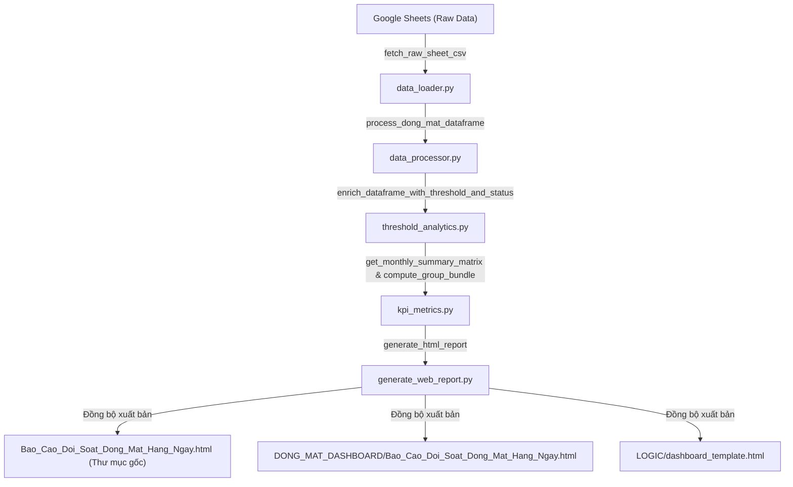

# TÀI LIỆU TOÀN DIỆN VỀ LOGIC & KIẾN TRÚC DASHBOARD ĐỐI SOÁT ĐÔNG - MÁT

> **Hệ thống**: Báo Cáo Đối Soát Hàng ĐÔNG - MÁT SCM (Kingfoodmart)  
> **Cập nhật lần cuối**: 27/08/2026  
> **Đường dẫn thư mục**: `g:\My Drive\Đối soát SCM\LOGIC`

---

## 1. MỤC TIÊU NGHIỆP VỤ & PHẠM VI
Hệ thống báo cáo đối soát ĐÔNG - MÁT giải quyết bài toán kiểm soát chênh lệch hàng hóa giữa xuất kho SCM và nhận tại chuỗi siêu thị Kingfoodmart:
1. **Phân loại hàng hóa**: Tách biệt rõ ràng **Hàng MÁT** (bảo quản mát, hạn ngắn, rủi ro hao hụt cao) và **Hàng ĐÔNG** (bảo quản đông lạnh).
2. **Kiểm soát trọng điểm theo Ngưỡng 100.000 VNĐ / Siêu Thị / Ngày**: Nhận diện ngay các siêu thị có tổng mức lệch $\ge 100\text{k}$ để ưu tiên xử lý dứt điểm trước.
3. **Minh bạch Điểm Nhận Trách Nhiệm**: Phân bổ chính xác nguyên nhân và trách nhiệm chênh lệch về cho **Kho ĐÔNG MÁT**, **Siêu Thị** hay **Hao Hụt**.
4. **Theo dõi Tiến Độ Xử Lý & Thu Hồi Tiền**: Giám sát dòng tiền đã xử lý xong, đang xử lý, và các khoản tồn đọng chưa giải quyết.
5. **Theo dõi Đối Soát Trả DC & Phản Hồi DC**: Giám sát tỷ lệ chấp thuận claim bồi hoàn, các dòng bị từ chối và nút thắt hàng chờ duyệt giữa Hàng Mát và Hàng Đông.

---

## 2. QUY TẮC NGHIỆP VỤ (BUSINESS RULES & FORMULAS)

### 2.1. Phân Loại Nhóm Hàng
* **MÁT**: Dựa trên cột `Nhóm hàng` chứa chữ "MÁT" hoặc mã nhóm liên quan đến thực phẩm mát/tươi sống (Thịt mát, rau củ quả, sữa mát, kem...).
* **ĐÔNG**: Dựa trên cột `Nhóm hàng` chứa chữ "ĐÔNG" hoặc nhóm hàng đông lạnh.
* **TẤT CẢ**: Hợp nhất toàn bộ dữ liệu ĐÔNG + MÁT.

---

### 2.2. Quy Tắc Ngưỡng 100.000 VNĐ / Siêu Thị / Ngày (Store-Day Threshold)
* **Khái niệm**: Ngưỡng được tính trên **Tổng giá trị chênh lệch tuyệt đối của một siêu thị trong cùng một ngày**, không tính riêng lẻ từng dòng SKU.
$$\text{Store\_Day\_Val\_Total} = \sum_{\text{cùng ST, cùng Ngày}} |\text{Chênh lệch}| \times \text{Đơn giá}$$
* **Phân loại**:
  * **ST $\ge$ 100.000 VNĐ** (`Is_Store_Over_100k = True`): Nhóm rủi ro cao, bắt buộc phải có biên bản giải trình hoặc xử lý bù trừ dứt điểm.
  * **ST < 100.000 VNĐ** (`Is_Store_Over_100k = False`): Nhóm chênh lệch nhỏ/hao hụt tự nhiên, xử lý định kỳ theo dõi.

---

### 2.3. Điểm Nhận Trách Nhiệm (Destination Mapping)
Dựa trên cột `Lỗi` và phân tích chứng từ:
1. **Kho ĐÔNG MÁT**: Các lỗi soạn thiếu, giao thiếu nguyên thùng/két, soạn nhầm mã tại kho trung tâm.
2. **Siêu Thị**: Các lỗi kiểm đếm nhầm, nhận thiếu sót tại cửa hàng, siêu thị xác nhận mất mát tại quầy.
3. **Hao Hụt**: Hàng dập nát, hư hỏng trong quá trình vận chuyển, rò rỉ nhiệt độ, hao hụt định mức.

---

### 2.4. Quy Tắc Phân Loại 3 Trạng Thái Tiến Độ Xử Lý (3-Level Processing Status)
> **Quy định**: Phân loại dựa hoàn toàn vào **Cột Z (Kho ĐÔNG MÁT / Điểm Nhận Trách Nhiệm)** và **Ngưỡng Lệch Siêu Thị Ngày**:
* **🟢 Đã Xử Lý**: Dòng hàng đã xác định rõ điểm nhận trách nhiệm tại Cột Z (`Kho ĐÔNG MÁT`, `Siêu Thị`, hoặc `Hao Hụt`).
* **🟡 Đang Xử Lý (ST ≥ 100k)**: Dòng hàng có Cột Z ghi nhận là `Chưa xác định`, VÀ thuộc Siêu Thị trong ngày có tổng giá trị lệch $\ge 100.000\text{ VNĐ}$ (`Is_Store_Over_100k = True`). Đây là nhóm trọng điểm cần đối soát và xử lý dứt điểm.
* **⚪ Không Xử Lý (ST < 100k)**: Dòng hàng có Cột Z ghi nhận là `Chưa xác định`, NHƯNG thuộc Siêu Thị trong ngày có tổng giá trị lệch $< 100.000\text{ VNĐ}$ (`Is_Store_Over_100k = False`). Khoản lệch nhỏ/hao hụt tự nhiên được miễn trừ xử lý bù trừ.

---

### 2.5. Phân Cấp 3 Mức Độ Ưu Tiên Siêu Thị (Store Priority Levels)
Hệ thống tự động xếp hạng từng siêu thị theo mức độ khẩn cấp để SCM phân bổ nguồn lực:
* **🚨 Ưu tiên 1 (P1 - ĐANG XỬ LÝ: ST ≥ 100k)**: Siêu thị có tổng lệch $\ge 100.000\text{ VNĐ}$ và còn các dòng chênh lệch chưa xác định điểm nhận (Cần ưu tiên xử lý gấp nhất).
* **⚪ Ưu tiên 2 (P2 - KHÔNG XỬ LÝ: ST < 100k)**: Siêu thị có tổng lệch nhỏ $< 100.000\text{ VNĐ}$ (Không cần can thiệp xử lý bù trừ).
* **🟢 Ưu tiên 3 (P3 - ĐÃ XONG 100%)**: Toàn bộ chênh lệch của siêu thị trong ngày đã được xác định và xử lý dứt điểm 100%.

---

### 2.6. Quy Tắc Đối Soát Trả Kho DC & Phản Hồi DC
Theo dõi toàn bộ các dòng hàng chuyển giao trách nhiệm về cho Kho DC (`Destination = "Kho ĐÔNG MÁT"`):
* **🟢 DC Đồng ý claim**: Kho DC chấp nhận bồi hoàn công nợ chênh lệch cho Siêu Thị.
* **🔴 DC Từ chối claim**: Kho DC từ chối bồi hoàn (yêu cầu Siêu Thị hoặc SCM chịu trách nhiệm/hạch toán hao hụt).
* **🟡 DC Kiểm tra lại / Đang chờ**: Các dòng hàng đang trong quá trình tra soát, trích xuất camera hoặc đối chiếu phiếu giao nhận 3 bên.
* **Tỷ Lệ Phản Hồi DC (%)**: 
$$\text{Tỷ Lệ Phản Hồi} = \frac{\text{Số dòng (Đồng ý + Từ chối + Kiểm tra lại)}}{\text{Tổng số dòng gửi trả DC}} \times 100\%$$

---

## 3. KIẾN TRÚC HỆ THỐNG & DÒNG DỮ LIỆU (DATA PIPELINE)

---

## 4. ĐẶC TẢ GIAO DIỆN & TRẢI NGHIỆM NGƯỜI DÙNG (UI/UX)

### 4.1. Bộ Chuyển Đổi Nhóm Hàng & Tháng
* Chuyển đổi linh hoạt `[🌿 HÀNG MÁT]` | `[❄️ HÀNG ĐÔNG]` | `[🌐 TẤT CẢ HÀNG]` và Lọc theo Tháng / Toàn kỳ tức thì (0ms latency).

### 4.2. Bộ 8 Biểu Đồ Trực Quan Toàn Diện (Kèm Tính Năng Thu / Phóng Zoom Modal)
* **Biểu đồ 1 (Cột & Đường - Full Width)**: So sánh số vụ việc (cases) & Tỷ lệ xử lý (% hoàn tất) giữa 2 phân khúc ST ≥ 100k vs ST < 100k.
* **Biểu đồ 2 (Cột & Đường)**: Biến động Tổng tiền lệch (VNĐ) & Số lượng lệch (PCS/KG) theo ngày.
* **Biểu đồ 3 (Cột Chồng & Đường)**: Tiến độ xử lý chênh lệch theo ngày (Đã xử lý, Đang xử lý, Không xử lý & Đường % hoàn tất).
* **Biểu đồ 4 (Cột Chồng)**: Số lượng Siêu Thị (ST) phát sinh lệch theo ngày (Nhóm ST ≥ 100k vs ST < 100k).
* **Biểu đồ 5 (Đường Vùng)**: Biến động giá trị tiền lệch của nhóm ST ≥ 100k và ST < 100k.
* **Biểu đồ 6 (Doughnut Tròn & Legend List)**: Phân bổ cơ cấu trách nhiệm (Kho ĐÔNG MÁT, Siêu Thị, Hao Hụt, Đang XL, Không XL).
* **Biểu đồ 7 (Cột Chồng & Đường - Full Width)**: Tiến độ xử lý trả DC & Tỷ lệ DC phản hồi theo ngày (Đồng ý, Từ chối, Kiểm tra lại/chờ & % Phản hồi).
* **Biểu đồ 8 (Cột So Sánh Đôi Mát vs Đông)**: Phân bổ kết quả DC phản hồi giữa Hàng Mát và Hàng Đông. Từng cột hiển thị nhãn kép: **Số dòng thực tế + Tỷ lệ % trong nhóm** (VD: `3.574 (28.3%)`, `8.558 (67.7%)`).
* **Tính năng Phóng to (Chart Zoom Modal)**: Bấm `Phóng to & Nhận xét` tại bất kỳ biểu đồ nào để xem biểu đồ phóng lớn, kèm **Bảng Ma Trận Chi Tiết (Matrix Table)** và **Nhận xét Vận hành SCM**.

### 4.3. Hệ Thống 4 Bảng Báo Cáo Phân Tầng
* 📊 **BẢNG TỔNG HỢP TIẾN ĐỘ**: Tích hợp 2-trong-1 (SL & Tiền VNĐ), hiển thị số lượng Siêu Thị mờ nhạt ở từng cột tiến độ.
* 💵 **BẢNG GIÁ TRỊ (VNĐ)**: Báo cáo chi tiết dòng tiền chênh lệch theo ngày/tháng.
* 📦 **BẢNG SỐ LƯỢNG (PCS / KG)**: Báo cáo chi tiết số lượng hàng hóa chênh lệch theo ngày/tháng.
* 🚚 **BẢNG TRẢ DC & PHẢN HỒI DC**: Báo cáo chuyên sâu về số dòng hàng gửi trả DC, số tiền, số ST, số dòng DC đồng ý, từ chối, đang kiểm tra và tỷ lệ % phản hồi.

---

## 5. NGUYÊN TẮC NHẬN XÉT VẬN HÀNH (OPERATIONAL SCM LANGUAGE)
* Nhận xét và đề xuất hành động luôn tuân thủ nguyên tắc:
  * **Trực tiếp, cụ thể**: Nêu rõ số dòng hàng, số tiền, số siêu thị.
  * **Dùng thuật ngữ vận hành kho/SCM quen thuộc**: Kho DC, Siêu Thị, Dòng hàng, Đồng ý claim bồi hoàn, Từ chối, Đang chờ duyệt, Tiền lệch, Hao hụt.
  * **Không dùng từ ngữ trừu tượng, hoa mỹ hoặc vẽ thêm từ**.

---

## 6. DANH MỤC CÁC TỆP HỆ THỐNG
1. `generate_web_report.py` : Script chính tạo báo cáo HTML, nhúng dữ liệu JSON và đồng bộ vào 3 vị trí.
2. `threshold_analytics.py` : Phân tích ngưỡng 100k, điểm nhận và trạng thái 3 cấp.
3. `kpi_metrics.py`         : Tính toán ma trận tổng hợp ngày/tháng và các chỉ số DC.
4. `data_processor.py`      : Chuẩn hóa dữ liệu thô từ bảng tính.
5. `data_loader.py`         : Nạp dữ liệu Google Sheets.
6. `Mo_Bao_Cao.bat`         : Phím tắt nhấp đúp để mở báo cáo trên Windows.
7. `Bao_Cao_Doi_Soat_Dong_Mat_Hang_Ngay.html` : Tệp dashboard báo cáo chính.
8. `LOGIC/` : Thư mục lưu trữ tài liệu logic, kiến trúc và bản mẫu dashboard.
